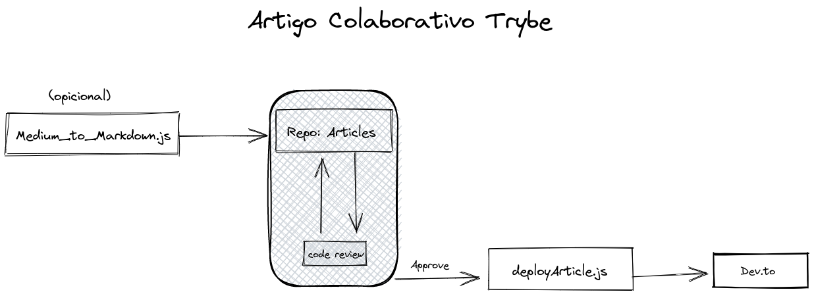

## Articles

I create this repo to organize and search for collabs before publish articles.

---

### List of articles

#### Le Alchimie

##### (Série: Primeiros passos no Elixir)

- [Meus primeiros passos no Elixir - Configuração](https://github.com/igorgbr/articles/blob/main/Elixir/PrimeirosPassos/configuracao.md)
- [Meus primeiros passos no Elixir - Iniciando um projeto com MIX](https://github.com/igorgbr/articles/blob/main/Elixir/PrimeirosPassos/conceitos_iniciais.md)
- [Meus primeiros passos no Elixir - Pattern Matching e Funções Built in](https://github.com/igorgbr/articles/blob/main/Elixir/PrimeirosPassos/pattern_mathing_built_in.md)
- Meus primeiros passos no Elixir - Phoenix

#### Python

- [Iniciando no Django - Pt. 1](https://github.com/igorgbr/articles/blob/main/Python/Iniciando_uma_aplica%C3%A7%C3%A3o_com_Django_Framework.md)

#### General
- [Direto ao ponto: O que é CRUD](https://github.com/igorgbr/articles/blob/main/General/Direto_ao_ponto:_O_que_%C3%A9_CRUD%3F.md)
- [Estamos vivendo uma era estranha...](https://github.com/igorgbr/articles/blob/main/General/Estamos_vivendo_uma_era_estranha%E2%80%A6.md)
- [Programar não é fácil](https://github.com/igorgbr/articles/blob/main/General/Programar_n%C3%A3o_%C3%A9_f%C3%A1cil!.md)
- [Sequelize - A solução para os seus relacionamentos](https://github.com/igorgbr/articles/blob/main/General/Sequelize_%E2%80%94_A_solu%C3%A7%C3%A3o_para_seus_relacionamentos!.md)

---


## Sobre
O Projeto tem como objetivo tornar mais facil o processo de colaboração e publicação de artigos.

## Configuração

Crie um arquivo helper.ex com essa estrutura (opcional):

```elixir
defmodule ProjectArticlesElixir.Helper do

  def api_key_string() do
    "<API_TOKEN>"
  end

end
```

P.S: você pode adaptar os PATHS da forma que achar melhor.

## Como funciona
Se você quiser transferir um artigo do Medium para o Dev.to deve primeiro converter para markdown, você pode utilizar o script 'medium_to_markdown.js'

<!-- ### Como converter um artigo do Medium para Markdown

É nescessário ter o Node instalado.

clone o repositorio
```Shell
    git clone git@github.com:igorgbr/articles.git
```

Instale as bibliotecas
```Shell
    mix deps.get
```

Rode o projeto no MIX
```Shell
    iex -S mix
``` -->

<!-- Será gerado no caminho escolhido um arquivo de nome igual ao titulo do artigo no formato MD. -->


### Como fazer o deploy para o Dev.to
[Documentação da API](https://developers.forem.com/api/#section/Authentication)

Instale as dependencias
```Shell
    mix deps.get
```
Rode o iex com Mix
```Shell
    iex -S mix
```

Chame o módulo e a função principal no iex:
O nome do arquivo deve ser sem traços ou caracteres especiais.
o arquivo deve estar localizado na raiz do projeto.

```elixir
    ProjectArticlesElixir.main("nome_do_arquivo.md")
```


Insira seu nome de usuario do dev.to (obrigatório)
```Shell
    nome de usuario: igorgbr
```

Insira o ID da organização (Se não for postar na organização digite 0) (obrigatório)
```Shell
    ID da organização: 4563
```

Insira o titulo do seu artigo (obrigatório)
```Shell
    Titulo do artigo: Meu artigo TOP
```

Insira o titulo da série (Se não fizer parte de uma série pressione "ENTER") (opcional)
```Shell
    Titulo da série: Sequencia de artigos top
```

Insira as HASHTAG'S separadas por espaço (opcional)
```Shell
    Tags (separadas por espaço): trybe elixir iniciante
```
